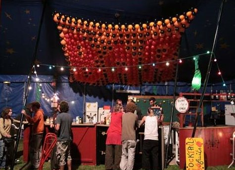
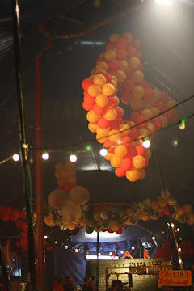

### La décoration

   

Une jolie décoration est importante pour donner de l’originalité et une identité visuelle à votre convention. Voici des trucs et astuces pour faire de la recup et créer des décos sympas et faciles.

Des moquettes ! elles peuvent être récupérées à la fin des salons des parcs d’exposition : elles sont souvent en bon état et en général conformes aux normes incendies. les jongleurs seront heureux d’avoir un coin moquette pour jongler. 

Les cendriers, plus il y en a et moins on perd de temps à la fin de la convention à courir après les mégots. Il faut qu’ils soient visibles et si possible qu’ils ne se renversent pas ..chacun ces préférences mais les boites conserve remplies de sable font bien l’affaire.

Le coin salon, recup de canap grâce au bouche à oreille ou à emmaus pour que les festivaliers puissent s’installer confortablement dans un coin convivial. Le coin salon est parfois modeste parfois exubérant quelques canapé c’est suffisant pour créer un espace détente .. 

Le Bar : La deco ce concentre souvent sur cet espace qui s’y prête bien ( comptoirs en palettes ou en acier, deco lumières, tableau des tarifs )
    
La signalisation, pour trouver rapidement le camping ou le coin camion,pour distinguer les douches des vestiaires.
         
  

Les outils nécessaires pour la deco (si besoin étiquetez à qui appartiennent les objets asso /particulier etc..) :
de la peinture, un bon cutteur, des feutres, du fil de fer, un bon vieux pistolet à colle, du grillage et des journaux pour le papier mâché, des ballons à sculpter, du papier craft, une agrafeuse murale, du scotch et du gaffer, des clous, une perceuse visseuse, des palettes, des planches de bois,une scie sauteuse.