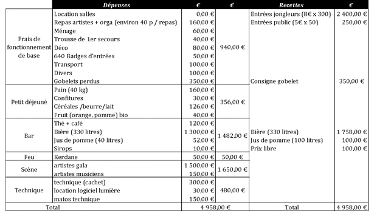

## Avant la convention – Les tâches fondamentales

L’architecture de l’organisation repose sur un équilibre harmonieux entre plusieurs piliers distincts, mais fondamentaux. La convention repose sur les envies, les idées et sur le temps que l’on consacre à sa préparation. De même, elle repose sur les moyens de l’association (humains, techniques et financiers) et sur le lieu et les dates de l’événement. Enfin, la convention dépend du nombre de participants.

C’est pourquoi, le montage du projet, la recherche d’un lieu et des dates sont les tâches fondamentales qui peuvent se faire en parallèle et doivent s’imbriquer naturellement. Il faudra trouver le bon compromis entre, le site, la durée de l’événement, les moyens à disposition et le temps nécessaires à la réalisation.

Cette section vous propose déterminer ce que vous voulez faire (vos besoins), puis d’identifier ce que vous pouvez faire (vos moyens), pour ensuite confronter vos besoins et vos moyens afin de trouver le bon compromis entre les deux ! Il s’agit de faire une liste de tout, puis de projeter une "vision d'ensemble".

### 1)	Réunions de l'équipe organisatrice 

Proposez à l’équipe organisatrice, une première date de réunion au moins quelques mois avant l’événement pour se laisser le temps de s’organiser. On peut par exemple faire une demande de réunion par mail en créant d’abord un « Framadate » ou un « Doodle » ou créer un forum (comme « Slack » ou autre) pour informer les personnes susceptibles d’être motivées par le projet. Ensemble, vous formerez le "noyau" de l'organisation, et vous partager les responsabilités.
Faire un ordre du jour. Si vous avez déjà organisé une convention, vous pouvez préparer cette réunion en vous appuyant sur le dernier bilan moral et financier de l’édition précédente, pour fixer les objectifs de l’événement à venir. 

**Définir vos besoins (idées et envies : quoi, pourquoi, pour qui, pour combien ?) :**

Pour que l’équipe organisationnelle soit motivée, il est important que chacun puisse exposer ses envies et proposer ses idées. L’équipe devra ainsi déterminer ses besoins en sélectionnant collectivement les idées qui seront retenues pour organiser la convention. Au terme de la réunion, l’équipe devrait avoir un cadre consensuel clair qui permet de répondre unanimement et sans ambiguïté aux questions suivantes : 
- Quel est le nom de la convention ?
- Qu’est-ce que l’équipe veut véhiculer comme messages ou actions (culturels, artistiques, citoyens…) ?
- Combien de temps durera la convention ?
- À qui s’adresse la convention ? Est-ce qu’elle sera ouverte à tous (autant fêtards, que familles, animaux acceptés) ? Uniquement aux jongleurs, ou également pour un public des environs ? Quels prix d’entrées ? Combien de participants sont attendus ?
- Quelle sera la programmation jour / jour ? Quelles animations ? Quels spectacles ?
- Proposons-nous une buvette et une restauration sur la convention ?
- En fonction du nombre de participants, évaluer l’espace dont vous aurez besoin pour : la jongle, la cuisine, les petits déjeuners et la restauration, l’espace scénique, l’espace feu, dormir, les parkings voitures et camions, les sanitaires… ? 
- Est-ce que vous favoriser l’autogestion des participants (nourriture, nettoyage...), ou faites-vous « sous-traiter » ces actions par des bénévoles ?
	
_Remarque : il faut distinguer une convention, d’une rencontre de jonglerie.
Une convention se déroule sur plusieurs jours consécutifs et à un programme important. 
Lorsqu’on annonce une convention de jongle, il est probable que des jongleurs font plus de 800 km pour venir vous voir…
Si cette ambition est trop forte pour vous pour le moment, vous pouvez toujours organiser une rencontre de jonglerie. La rencontre de jonglerie est destinée à un public plus régional, elle dure moins longtemps et la programmation peut être très flexible._

**Définir vos moyens (qui, quand, où, comment, avec quoi et avec combien ?) :**

Une fois que les besoins de la convention ont été déterminés et validés collectivement, il s’agit de déterminer les moyens qui vont vous permettre de mener à bien l’événement.
L’équipe devra ainsi identifier ses moyens en les listant collectivement. Au terme de la réunion, l’équipe devrait avoir un cadre consensuel clair qui permet de répondre unanimement et sans ambiguïté aux questions suivantes : 
- Qui et combien de personnes organisent la convention ?
- Comment se répartir les tâches entre organisateurs ? Qui veut faire quoi ?
- De combien de bénévoles avons-nous à disposition ?
- Où et quand réaliser la convention ? Quelle période de l’année ? Quel type de site (intérieur en salle, ou extérieur avec chapiteau, ou les deux) ? La saison et zone géographique peuvent avoir des conséquences sur votre événement. Il faudra donc pensez au froid, à la chaleur, à la pluie, aux orages, ...
- Lister le matériel nécessaire de sonorisation, lumière, cuisine, restauration, décoration, sécurité… Réfléchissez à comment trouver le matériel, comment l’emmener sur place et comment le ramener.

Organiser autant de réunions que nécessaires pour proposer vos idées, pour décider ensemble de ce que vous allez faire et pour vous répartir les tâches. À chaque réunion, prenez des notes, puis **envoyer tous les compte-rendu à tous les organisateurs. **

Une fois que le compte rendu est envoyé à tous les autres organisateurs, chacun se charge de faire ce pourquoi il s’est engagé. Il est intéressant de faire une liste récapitulative en bas du compte-rendu de « qui fait quoi ».

### 2)	Rédiger un document détaillé du montage de la convention

Maintenant que vous avez défini vos besoins et vos moyens généraux, il s’agit de les concrétiser… Pour se faire, nous vous conseillons de vous appuyer sur les conseils qui vont suivre et sur les compte-rendu de vos réunions. Les besoins et les moyens du montage du projet (humains techniques, financiers, lieu, dates…) devraient à terme être rédigés et compilés dans un document qui vous servira à répondre aux différentes questions sur la convention, des organisateurs, des bénévoles, des partenaires, des médias et des pouvoirs publics. La suite détaille plus précisément les tâches à effectuer pour le montage de ce dossier.

### 3)	Trouver un lieu et une date

**C’est une phase très importante de l’organisation. Il faut prévoir un temps suffisant pour rechercher le site adéquat.  **

Posez-vous d’abord la question de la période de l’année à laquelle vous voulez organiser votre convention ! Selon la région et la période de l’année, le climat peut être plus ou moins clément. Vous pouvez organiser une convention qui se déroulera 100 % à l’intérieur, ou 100 % à l’extérieur, ou faire un mixe des deux. À l’intérieur, il faut suffisamment de hauteur de plafond pour pouvoir jongler. À l’extérieur, il faut veiller plus attentivement à la sécurité des participants et du site en général : Canicule ? Pluie ? Froid ? Faut-il des barrières Heras ?, faut-il des toilettes sèches ?, Y a-t-il un accès à l’eau potable ? Douches extérieures ? Accès à l’électricité (ou groupe électrogène) ? Camping (tentes, camion) ? Parking ? Chapiteau ? Tonnelles ? Bar et Restauration (pensez à prendre en compte le climat quand on compare les consommations du bar et aussi les menus pour la restauration) ?
	
Une fois que vous avez choisi la configuration du site, il faut le trouver ! Renseignez-vous pour connaître les endroits potentiels : sur Internet (n’hésitez pas à regarder la cartographie, les images satellites… sur [géoportail](https://www.geoportail.gouv.fr/?target=_blank) par exemple, pour voir la taille des terrains, la surface des salles, la distance avec le voisinage...), chez vos amis, les histoires du week-end de vos collègues, les lieux de fêtes et festivals de vos régions… 
Lors de cette étape, vous pouvez faire un plan du site (en superposant votre propre implémentation personnaliser du site, à la cartographie existante).

Une fois que vous avez trouvé un ou plusieurs site(s) potentiel(s), il faut trouver le contact des gérants du site et les contacter.

Pour que les propriétaires de la salle comprennent bien de quoi il s’agit et leur donner envie de nous prêter ou louer la salle, on peut leur envoyer un dossier de présentation (N.B : pour la demande de salle(s), il ne faut pas joindre le budget prévisionnel ; le budget prévisionnel est à inclure pour les demandes de subventions). Celui-ci sera notamment variable en fonction du prix du lieu !

Le petit conseil que l’on peut vous donner, c’est d’essayer d’avoir le site gratuitement… Je m’explique : la jonglerie et les arts du cirque en général, ont bonne presse les dernières années (cirque à l’école, cirque adapté, divertissement politiquement correct, mixité entre pratique amateur et professionnelle…). Bref, les conventions de jonglerie sont susceptibles et capables de séduire les collectivités territoriales et autres pouvoirs publics. Ils n’ont pas beaucoup de moyens pour les associations, mais nous leur demandons uniquement d’occuper un site (sur lequel ils paient de toute façon les charges fixes) et qui ne serait pas occupé si la convention n’avait pas lieu. En clair, cela ne leur coûte pas grand-chose de nous accueillir, alors que cela leur permet d’étoffer leur offre culturelle, d’avoir de beaux articles de presse, le tout à moindre coût (presque rien !). De plus, accueillir un tel rassemblement sur sa commune permet de faire fonctionner les commerces locaux, ce qui intéresse les communes/collectivités locales. À la Glühwein en Alsace, la convention commence le vendredi matin par une initiation aux arts du cirque des enfants de plusieurs classes des écoles du village. Cette initiation est un argument supplémentaire pour avoir le site gratuitement et permet d’avoir une jolie couverture des médias. La parade permet aussi d’avoir une visibilité auprès de la population, des médias et des élus.

[Exemple de 1er mail de mise en contact.pdf](Exemple%20de%201er%20mail%20de%20mise%20en%20contact.pdf?target=_blank)

Exemple de dossier de présentation : [CFJ2020 Dossier de présentation.pdf](CFJ2020%20Dossier%20de%20pr%C3%A9sentation.pdf?target=_blank)

**Remarque importante :** à cette étape du montage de l'événement, le dossier n'a pas besoin d'être aussi fourni que l'exemple ci-joint. Néanmoins, il permet de se faire une idée des questions à ce poser en réunions.

Trouver ensuite, la personne qui s’occupe de contacter les mairies pour convenir d’un rendez-vous pour expliquer le projet. Et définir qui, par la suite, assure le contact avec la ville d’accueil définitive et assure la gestion du site et des salles. Il faudra prendre rendez-vous pour une visite du site (pensez à prendre des photos ou vidéos) et éventuellement prendre rendez-vous avec les services techniques de la ville. Renseignez-vous afin de connaître la date et l’heure à laquelle vous pouvez occuper le site et à quelle date vous devez quitter et faire l’état des lieux. Voir pour les clefs, les alarmes, l’inventaire du matériel à disposition, les équipements de cuisine (fours, plaques de cuisson, réfrigérateurs …), les poubelles, la caution, les branchements électriques…

Les questions à poser au propriétaire du site devraient concerner les critères nécessaires à la réalisation de la convention. 
Par exemple, voici une liste de critères nécessaires et les questions techniques et budgétaires à poser pour une convention de 300 jongleurs, pendant 3 jours (pour avoir un confort convenable pour tous) :
- Grande salle ouverte 24h/24 (min 800m², si une seule salle ; min 400m² si deux salles) avec un haut plafond
- Cuisine équipée
- Sleeping ou camping pour 300 personnes
- Toilettes et Douches
- Chauffage (selon la période de l'année et le lieu géographique de la convention)
- Scène de spectacle (avec du plafond)
- Lieu de stockage fermé à clef (pour certains matériels précieux pendant la convention)
- Lumières
- Tarifs et conditions pour l’ensemble des jours de la convention
- Listing du matériel à disposition
- Date de mise à disposition des lieux (début et fin)
- Contact de la personne coordinatrice de la mairie (l'attaché culturelle + les services techniques)

**Nous vous recommandons très fortement d'avoir la confirmation de la réservation du site avant de faire les autres étapes.**

### 4)	DEFINIR LES MOYENS TECHNIQUES PRIMORDIAUX

Lister le matériel nécessaire de sonorisation, lumière, cuisine, restauration, décoration, sécurité… Réfléchissez à comment trouver le matériel, comment l’emmener sur place et comment le ramener.

### 5)	DEFINIR LES MOYENS FINANCIERS ET LE BUDGET PREVISIONNEL

Il faut se poser plusieurs questions :
- Qu’est-ce qu’on doit acheter ? : faire la liste exhaustive de tous les achats prévisionnels 
- Quel est le budget prévisionnel ? 
- Comment sont répartis les bénéfices ou les pertes ?
- …

#### Définir le budget prévisionnel
- Qui se propose de centraliser les infos budgétaires (dépenses et recettes prévisionnelles) et de faire un tableau récapitulatif ? Le mieux, c’est que ce soit le trésorier de l’association, ou qu’une personne coordonne le pôle administratif et financier et que les charges soient réparties sur plusieurs personnes. C’est une sécurité en cas de défection.
- Et qui se propose de centraliser les recettes et dépenses réelles de faire un tableau récapitulatif ? Là aussi, le mieux c’est que ce soit le trésorier de l’association.

	Attention : il faut avoir assez d'argent pour couvrir tous les dépôts dont vous avez besoin (fonds propres, dons, préinscriptions, subventions…).
	Une fois que votre budget a été approuvé par l’équipe, le référent devrait essayer d'obtenir autant de confirmations que possible sur les dépenses. 

Exemple de budget prévisionnel:

Attention : le budget prévisionnel présenté aux partenaires doit être à l’équilibre. Néanmoins il est possible d’avoir un budget légèrement différent en interne : comme habituellement les financeurs donnent moins que le montant des demandes, vous pourrez avoir moins de ressources que prévues, et donc il faudra diminuer certaines charges.

### 6)	DEFINIR LA PROGRAMMATION

Qu’est ce qui va se passer jour par jour  ?

Exemple de programmation téléchargeable en format Excel: [CFJ_prog&planning.xlsx](CFJ_prog&planning.xlsx?target=_blank)

### 7)	DEFINIR LES MOYENS HUMAINS 

Exemple de listing pour la scène téléchargeable en format Word: [check_list scene.docx](check_list%20scene.docx?target=_blank)

Combien de personnes organisent, combien sont bénévoles (en amont ?, en aval ?) ; qui fait quoi ?...  
Il s’agit de choisir la forme organisationnelle. Par exemple, on peut choisir de définir des référents par pôle :  
- superviseur général (gestion du projet et de l’équipe, gestion des plannings organisateurs, bénévoles et volontaire, planning montage et démontage…)
- réunions (communication de la date, ordre du jour, compte rendu…)  
- administratif et financier (subventions, bilan, autorisations...)
- communication (mairie, journaliste, conventionniste…)
- logistique & développement durable (site, électricité, coin pour les organisateurs, artistes et bénévoles, chapiteaux, tentes, barrières, services municipaux, chill-out, toilettes sèches, poubelles de tri, déchet, recyclage...) 
- [décoration et signalétique](/les-conventions/organiser-une-convention/aspects-thematiques/la-decoration)
- sécurité
- technique scénique
- plateau artistique
- cuisine (récup en amont + menu + gestion en aval)
- petit-déjeuner
- [accueil](/les-conventions/organiser-une-convention/aspects-thematiques/accueil) des conventionnistes (préinscriptions, tarifs, badges, billetterie, goodies...)
- buvette
- scène ouverte
- renegade
- espace feu 
- workshop
- [jeux de la jongle](/les-conventions/organiser-une-convention/aspects-thematiques/les-jeux-de-la-jongle) 
- musique et concerts
- animation cirque des enfants
- …

Une personne est susceptible d’occuper plusieurs de ces pôles à la fois, comme par exemple :
- Spectacles (Gala, scènes ouvertes, spectacle de rue, feu, concerts, renegade...)
- Prestataires (Chill-Out, Initiations, stands, ostéopathes, sécurité, photographes...)
- Animation (Workshops, initiations, Parade, Volley massue, [jeux de la jongle](/les-conventions/organiser-une-convention/aspects-thematiques/les-jeux-de-la-jongle)...)
- …

Une autre idée est d’avoir un référent et un assistant référent pour chaque pôle. Puis l’édition d’après (en n+1), l’équipe s’inverse : le référent devient assistant et l’assistant devient référent. Enfin, l’édition d’encore après (en n+2), le référent prend sous son aile, un nouvel assistant. Cela est une manière d’assurer la pérennité des compétences des organisateurs.
Si l’on choisit de ne pas avoir de référent par pôle, il faut quand même savoir déléguer les tâches, donc au moins les lister précisément.

### 8)	LA SUITE DES CHOSES A FAIRE

Une fois que l’équipe à déterminer l’ensemble des points précédents, on relance le groupe d’organisateurs par mail, ou autre, en leur donnant les infos. Le but étant de s’organiser et se mettre d’accord directement par rapport à ce qui a été dit pendant les réunions.
Selon le cas, on peut soit : rester en contact par forum ou chaînes de mails, soit fixer une nouvelle date de réunion. Le but étant que les différents pôles se constituent, s’organisent et transmettent de l’information à tous les autres organisateurs. Attention : les chaînes de mails ne sont pas très efficaces, car il est facile de casser la chaîne en omettant certains messages et il n’y a pas de recherche d’historique pour un nouveau venu.
Pour pouvoir s’organiser, il faut savoir si toutes les différentes tâches ont bien été attribuées et que tout le monde sache plus ou moins ce qu’il doit faire. Avoir un responsable imprévu peut être une bonne chose pour être sûr que tout sera traité. Il y a toujours des choses qui passent à travers le crible de la répartition.
Le référent général voit comment l’ensemble des pôles évolue et décide s’il faut ou non recadrer, au cas par cas ou de manière plus globale.

**Voici une liste des différentes tâches fondamentales à réaliser :**

#### Le référent général
- Si ce n’est pas encore fait, il faut désormais choisir une personne qui coordonne et redistribue les infos à l’ensemble du groupe pour faire régulièrement le point sur « où on en est ?» et « qu’est-ce qui reste à faire ?»

#### Les tâches administratives
- Assurer l’évènement : téléphoner à l’assureur et lui demander une attestation temporaire d’évènement culturel, qui couvre toute la durée de l'évènement.
- Donner l’attestation d’assurance de l’évènement à la mairie (et en garder une copie) et demander une autorisation municipale ou préfectorale de débit de boisson (qu’il faudra avoir sur soi, en cas de contrôle) .
- Choisir une personne coordinatrice avec la mairie, et les services techniques de la ville, les médias…
- Choisir une ou plusieurs personne(s) coordinatrice(s) avec les artistes (niveau technique scénique, hébergement, catering, droit de diffusion des photos ou vidéos et paiements des artistes).
- Est-ce que vous devez ou souhaitez faire une déclaration à la SACEM, concernant la musique que vous diffusez pendant la convention ?
- Avant, pendant et après, récupérer toutes les factures, tickets de caisse et notes de frais pour chaque dépense inhérente à la convention permet de faire un budget réalisé complet.
- Prévenir les pompiers pour la scène feu…

#### La communication

- Faire un logo de la convention
- Faire une affiche de l’évènement (avec dates, lieu, prix)
- Faire éventuellement une affiche pour l’initiation cirque des enfants (avec dates, lieu, programme)
- Faire éventuellement une affiche pour le programme
- Faire éventuellement une affiche pour le gala
- Faire éventuellement une affiche pour les concerts
- Faire un dossier de presse et l’adapter en fonction qu’on l’adresse aux jongleurs ou à l’attention des médias.
- Annoncer la convention sur le net : [www.afj.asso.fr](http://www.afj.asso.fr/?target=_blank), [www.jugglingedge.com/events](https://www.jugglingedge.com/events.php?target=_blank) (le calendrier mondiale des conventions), [www.inbaz.org](https://www.inbaz.org/?target=_blank) (le calendrier allemand des conventions), évènement Facebook... Pensez aussi à annoncer la convention auprès du réseau des organisateurs de conventions en France : pour se faire envoyer un mail sur afj@framalistes.org (merci de ne pas polluer cette adresse avec d’autres informations non-pertinentes ; elle nous est précieuse !).
- Annoncer l'événement dans la presse locale : faire un dossier de presse.
- Lancer et gérer les pré-inscriptions. Créer par exemple une boîte mail, permet de réceptionner les pré-inscriptions, répondre aux questions des conventionnistes, des bénévoles et artistes, de recevoir des propositions de numéros pour le gala, de workshops, de bénévoles... Pleins de jongleurs ont des questions avant de venir, donc il faut y répondre. 
- Demande d’autorisation parentale et photocopie de la pièce d’identité pour les mineurs non-accompagnés de leurs responsables légaux (ou demande de responsabilité civile par un adulte présent à la convention, mais qui n’est pas le responsable légal).
- Gérer l’après convention : bilan et remboursement, gestion des mails : matériel oublié et perdu et renvoi des affaires… Mise à jour des photos, vidéos et articles de presse sur le net.

#### Le camping ou le dortoir
- Prévoir les conditions d’hébergement des organisateurs, artistes et conventionnistes : anticiper le nombre de participants pour s’assurer que l’espace convient et assurer la sécurité des personnes et des biens.
- Il faudra aussi veiller aux nuisances sonores : camping famille à part du camping fêtards, mais aussi attention aux éventuelles plaintes des voisins.

#### La cuisine et récup de fruits et légumes
- Pour nourrir les organisateurs, bénévoles et artistes, il faut comptabiliser le nombre de personnes et le nombre de repas, demandez s’il y a des préférences alimentaires (végétarien, végétalien, halal, sans gluten… et faire des menus en avance).
- Faire le listing du matériel nécessaire : grandes casseroles, plats qui vont au four, percolateur, thermos, gobelets, bouilloires, couteaux, éplucheurs, planches à découper, serviettes, éponges, couverts, grande bassines pour la vaisselle, plan de travail…
- Faire de la récupération de fruits et légumes en fin de marché ou chez les producteurs en leurs expliquant que vous organiser une convention de jonglerie… 
- Est-ce qu’on propose une restauration sur place pour les jongleurs ? Si oui, quoi, comment ? Merci de penser aux végétariens et de penser au risque de gaspillage alimentaire.
- Pour trouver des producteurs, il est possible de contacter la Confédération Paysanne (syndicat d’agriculteurs qui défend une agriculture paysanne, respectueuse de l’environnement, de l’humain…), Nature & Progrès (une association de producteur et consommateur qui émet une mention plus restrictive que le label bio et qui prend en compte l’humain en plus du côté environnementale) ou le Groupement d’Agriculteurs Biologique.

#### Les petits déjeuners et les confitures
- Commander le pain à l’avance à la boulangerie, en fonction du nombre de participants (exemple : pour 400 personnes, il faut 40 kg) pour deux petits déjeuners et les repas de l’équipe organisatrice
- Avoir un ou plusieurs percolateurs pour le café
- Faire éventuellement des confitures en avance avec des récupérations de fruits
- Installer le petit-déjeuner le matin pour que les jongleurs puissent se servir

#### [L'accueil](/les-conventions/organiser-une-convention/aspects-thematiques/accueil)

L’accueil est un lieu important, c’est le premier lieu de rencontre entre l’organisation et les conventionistes. C’est également un lieu d’information et de vente des tickets d’entrée. Il faut donc lui attribuer une importance particulière. Idéalement, quelqu'un d'expérimenté sera responsable de l’accueil, arrivera tôt pour tout mettre en place, organiser l'espace, recruter une équipe de bénévoles dont il sait qu'il peut s'occuper, mettre des marchandises à portée de main, etc. Le responsable de l'accueil doit être en mesure de travailler à l’accueil (tout en sachant déléguer) - ce n'est donc pas un travail pour quelqu'un qui a d'autres responsabilités qui l'obligeront à se déplacer beaucoup sur le site. Pendant les périodes de grosses fréquentations, ce n'est pas un endroit pour quelqu'un qui n'a pas été briefé en amont.

**Matériel et espace nécessaires :**
Une zone bien choisie pour l’emplacement de l’accueil. Il faut beaucoup d'espace sécurisé derrière le bureau pour les marchandises, le stockage d'argent et les bénévoles. Idéalement, il y aura un accès facile et sécurisé de l'arrière de l’accueil du site pour l'encaissement. Prévoir d’évacuer l’argent de manière sécurisée et discrète pour qu’il n’y a pas trop d’argent à un moment donné (le premier soir par exemple). Le mieux est que l’argent quitte le site complètement.
Lorsque l’accueil est fermé, il doit y avoir un moyen de sécuriser le stock, les laissez-passer, les billets et ainsi de suite lorsque le bureau est fermé, ainsi que fermer l’accueil lui-même pour préserver son état de chaos pour le lendemain matin. Des toilettes à proximité sont également utiles, tout comme un point d'alimentation pour les bouilloires / grille-pain.

- Deux tables ou zones séparées : une pour le paiement à la journée, une pour les préinscrits.
- Une table en plus pour la vente de T-shirts (s’il en a), la vente de jetons (s’il en a) et renseignements, c'est-à-dire le point information de la convention.
- Pass d’entrée : Trouver une idée + Faire environs 400 pass d’entrée + ticket d'entrée pour public extérieur
- Panneau d’affichage des tarifs. À bien réfléchir en amont : tarif réduit pour les enfants, tarifs à la journée, avec ou sans spectacle…
- Caisse d'entrée : 
Il faut définir si vous optez pour des jetons ou pour de la monnaie. Si vous utilisez des jetons, vous pouvez contacter l’AFJ pour en avoir à disposition (afj.jonglerie@gmail.com). Si vous utilisez des euros, il faut prévoir un fond de caisse d’environ 300€ en pièces de 0.5€, 1€, 2€ et quelques billets de 5€
- Carton de gobelets recyclable (consigne = 1€)
- Avoir des documents pour informer les jongleurs (imprimer le programme et le plan de la ville pour les commerces, gare…)
- Stylos, markers, pinceaux, peinture, papier, carton, scotch, ficelle, pâte-à-fixe, punaises, agrafes, clous, marteau, pinces à linge, ciseaux, cutter...
- Avoir une liste et des enveloppes toutes prêtes pour toute personne pré-enregistrée : artistes, prestataire, bénévole, prépayé… Cela permet de gagner du temps le premier jour. L’enveloppe contient, le pass, les billets de spectacles, les éventuels tickets boisson et repas…
- Avoir une liste d'instructions pour les bénévoles : cela devrait inclure ce qu'ils doivent donner aux arrivants, comment contacter les organisateurs, et une transmission de toute autre information pertinente. Cela peut être écrit, mais vous devez également faire en sorte que les gens transmettent l'information à la prochaine série de volontaires, via une induction rapide.
- Monter une équipe de bénévoles pour servir à l’accueil pendant 3 jours. Et prévoir un moyen d’identifier les bénévoles (t-shirt, pass spécifique) si les bénévoles ont un pass prévoir de mettre au dos la liste des responsables de pôles avec le numéro de téléphone.

#### La sécurité
- Il faut un référent et une équipe qualifiée pour assurer la sécurité 24h/24
- Faire une liste d’évaluation des risques et des mesures et actions à prendre pour les supprimer ou les atténuer (accident corporel, sanitaire, feu, inondation, infiltration d’eau, installation électrique, éclairage, circulation des personnes, matériels et véhicules…)
- Se constituer une trousse de premier secours (on peut aller en pharmacie par exemple)
- Avoir les numéros d’urgence et un plan d’évacuation, en cas de besoin
- Faire passer une commission de sécurité, si nécessaire

#### [La décoration de la salle](/les-conventions/organiser-une-convention/aspects-thematiques/la-decoration)
- Avec quoi on peut personnaliser la salle :
	Une jolie décoration est importante pour donner de l’originalité et une identité visuelle à votre convention. Voici des trucs et astuces pour faire de la récupération et créer des décorations sympas et faciles.
- Des moquettes ! Elles peuvent être récupérées à la fin des salons des parcs d’exposition : elles sont souvent en bon état et en général conformes aux normes incendies. Les jongleurs seront heureux d’avoir un coin moquette pour jongler. 
- Les cendriers, plus il y en a et moins on perd de temps à la fin de la convention à courir après les mégots. Il faut qu’ils soient visibles et si possible qu’ils ne se renversent pas... Chacun ces préférences, mais les boîtes de conserve remplies de sable font bien l’affaire. On peut aussi fournir des cendriers de poche. Ils peuvent par exemple, être faits en récupération de bouchon. Il doit y avoir une vidéo sur le net pour voir comment on peut les faire. 
- Partenariat (invitations à venir voir des spectacles pendant la convention) avec des entreprises de BTP pour avoir des barrières Heras gracieusement (les grandes de chantier), qui sont souvent assez coûteuses à la location. Les communes/intercommunalités peuvent aussi en avoir à prêter. Pensez à demander aux communes voisines. On peut aussi y trouver des palettes Europe (pour les monocycles) et utiles en cas de pluie.
- Le coin salon, récup de canapés grâce au bouche-à-oreille ou à Emmaüs pour que les festivaliers puissent s’installer confortablement dans un coin convivial. Le coin salon est parfois modeste, parfois exubérant quelques canapés, c’est suffisant pour créer un espace détente. 
- Le Bar : la déco se concentre souvent sur cet espace qui s’y prête bien (comptoirs en palettes ou en acier, déco lumières, tableau des tarifs). 
- Les tentes sont aussi un truc qu'on manque toujours (et trop rares en général chez les mairies, comités des foires ou conseils généraux) : il peut y avoir des bons plans chez les scouts ou le Mouvement Rural de la Jeunesse Chrétienne, pour avoir des tentes marabouts, qui peuvent très bien servir pour accueillir des masseurs ou kinés.
- En faisant le tour des magasins de bricolage, il y a moyen de récupérer des pots de peinture de temps en temps. 
- Pour des toilettes sèches vite faites, une palissade entourant des grandes poubelles avec de la sciure dedans peut faire très bien l'affaire. Pour refourguer les excréments, c’est des fois un peu compliqué. Mais les agriculteurs peuvent être intéressés. Remarque : l’urine est encore pire à refourguer que les excréments, car elle est super acide et n’est pas très fertile.
- Penser à afficher des infos importantes comme : le programme de la convention (français et anglais), les tarifs du bar
- Panneau des workshops, 
- Panneaux de signalisation (chaussures interdites, espace dodo, douches, tri des déchets, covoiturage pour le retour…)
- Quels ateliers proposer en plus. Exemple : jeux de société, vidéos de jongle, carte géographique et punaises pour indiquer d’où viennent les conventionnistes …
- Multiprises pour brancher les téléphones portables des conventionnistes. Cela dit, faites attention à la charge électrique, car les chargeurs consomment vraiment beaucoup.

	Les outils nécessaires pour la déco (si besoin, étiquetez à qui appartiennent les objets associatifs /particuliers...) : de la peinture, un bon cutter, des feutres, du fil de fer, un bon vieux pistolet à colle, du grillage et des journaux pour le papier mâché, des ballons à sculpter, du papier craft, une agrafeuse murale, du scotch et du gaffer, des clous, une perceuse visseuse, des palettes, des planches de bois, une scie sauteuse.

#### Les workshops
Le sentiment d’avoir passé une bonne convention pour un jongleur, c’est aussi
lorsqu’il a bien jonglé et qu’il a appris des nouvelles figures. D’où
l’importance des workshops, qu’ils soient organisés ou spontanés.

Les workshops organisés, c’est pratique à ... organiser... Demandez aux gens
intéressés de vous prévenir à l’avance afin d’inclure l’atelier dans votre
programmation. Cela peut du coup faire venir des gens à la convention !

Les workshops spontanés c’est quand vous voulez, vous vous pointez à la
convention et vous inscrivez votre nom sur le tableau et c’est parti (n’oubliez
pas d’essayer de négocier ce repas/boisson... des fois ça marche). Et si vous
connaissez quelqu’un qui devrait donner un workshop, motivez-le : le partage,
c’est l’essence de la convention.
    
- Tableau de workshop

<table class="table">
<thead>
<tr><th colspan="3" class="text-center">WORKSHOPS</th></tr>
<tr><th>Horaire</th><th>SAMEDI</th><th>DIMANCHE</th></tr>
</thead>
<tbody>
<tr><td>10H-11H</td><td></td><td></td></tr>
<tr><td>11H-12H</td><td></td><td></td></tr>
<tr><td>12H-13H</td><td></td><td></td></tr>
<tr><td>13H-14H</td><td></td><td></td></tr>
<tr><td>14H-15H</td><td></td><td></td></tr>
<tr><td>15H-16H</td><td></td><td></td></tr>
<tr><td>16H-17H</td><td></td><td></td></tr>
<tr><td>17H-18H</td><td></td><td></td></tr>
<tr><td>18H-19H</td><td></td><td></td></tr>
<tr><td>19H-20H</td><td></td><td></td></tr>
</tbody>
</table>

Remarque : il faut renseigner le nom, le lieu (ex: grande salle), le thème (balles, diabolo...), le niveau (débutant...).

#### [Les jeux de la jongle](/les-conventions/organiser-une-convention/aspects-thematiques/les-jeux-de-la-jongle)
- Savoir qui s’occupe de les présenter et prévoir la logistique s’il y a de la musique.
- Définir quels jeux faires 
- Savoir ce qu’on offre comme cadeaux aux gagnants et combien de cadeaux il faut.
- Demander aux stands de matériel, ils ont toujours des choses à offrir avec parfois des super lots (3 massues)
- Si les jeux sont en extérieur, prévoir une zone d’ombre pour la régie son s’il y en a une. Prévoir des bouteilles d’eau.

#### La logistique et les transports 
- Prévoir un nombre de véhicules suffisant (voitures et camionnette).
- Voir où se trouve le matériel : qu’on a, qu’on doit acheter, louer, le nombre de personnes qu’il faut pour l’installation …
- Est-ce qu’on doit louer des moyens de transports ? Toute la durée de la convention ou seulement pendant le montage et le démontage ?
- Qui est disponible pour charger et décharger les courses, la décoration, le matériel de cirque, le son et la lumière, la cuisine, les poubelles … avant pendant et après l’événement.

#### Les vendeurs
- Est-ce que vous souhaitez avoir des stands de vente de matériel de jonglerie ? Si oui, contacter les vendeurs et s’arranger. Il faut penser aux moyens de mises à disposition des stands, s’ils doivent payer ? Et que faire si d’autres vendeurs non-annoncés s’installent ? 
  Nous vous recommandons
  [Net’Juggler](https://www.netjuggler.net/?msclkid=f1a9ea7aef991e545e1e8aad570ae288&utm_source=bing&utm_medium=cpc&utm_campaign=001%20Marque&utm_term=netjuggler&utm_content=Netjuggler%20exact),
  qui se déplacent régulièrement avec son camion, sur les conventions en France.
  Mais vous pouvez également faire appel à des jongleurs qui fabriquent
  eux-mêmes leurs matériels et sont capables d’installer des stands avec
  tonnelles. Si vous ne souhaitez pas avoir de vendeur, il faut clairement le
  préciser aux jongleurs (lors de la communication), sinon certains s’installent
  et vendent leur matériel fait maison. Vous devriez également vous interroger
  sur la place des vendeurs d’autres matériels (vêtements, bijoux, maquillage,
  objets en tout genre…), autorisé ou pas ? Mais attention, vous portez une
  forme de responsabilité qu’en à par exemple la qualité et la provenance des
  produits qui sont vendus sur votre événement. Donc attention à la législation
  et la réglementation du commerce. Pour s’en prémunir, n’autorisez pas les
  ventes dont vous n’avez pas confiance, ou de certificat.
