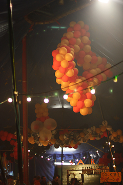

## La décoration

   

Une jolie décoration est importante pour donner de l’originalité et une identité visuelle à votre convention. Voici quelques trucs et astuces pour faire de la récupération et créer des décorations sympas et faciles.

La signalétique permet de trouver rapidement le camping ou le coin camion,pour distinguer les douches des vestiaires. Des piquets, de la peinture, du bois ou du carton feront l'affaire.

Des moquettes ! Elles peuvent être récupérées à la fin des salons des parcs d’exposition : elles sont souvent en bon état et en général conformes aux normes incendies. Les jongleurs seront heureux d’avoir un coin de moquette pour jongler. 

Pour un coin salon (chill-out), récupérer des canapés (notamment grâce au bouche-à-oreille, ou grâce à des organismes tel que Emmaüs) pour que les festivaliers puissent s’installer confortablement dans un coin convivial. Le coin salon est parfois modeste, parfois exubérant, mais quelques canapé c’est suffisant pour créer un espace détente. 

Le Bar : La décoration ce concentre souvent sur cet espace, qui s’y prête bien (comptoirs en palettes ou en acier, lumières, tableau des tarifs...)

Des cendriers, plus il y en a et moins on perd de temps à la fin de la convention à ramasser les mégots. Il faut qu’ils soient visibles et si possible qu’ils ne se renversent pas. Chacun ces préférences, mais les boites de conserves remplies de sable font bien l’affaire.

  

**Les outils nécessaires pour la décoration :**
de la peinture, un bon cutteur, des feutres, du fil de fer, un pistolet à colle, du grillage et des journaux pour le papier mâché, des ballons à sculpter, du papier kraft, une agrafeuse murale, du scotch et du gaffer, un marteau et des clous, une perceuse-visseuse, des palettes, des planches de bois,une scie sauteuse.
Si besoin étiquetez à qui appartiennent les objets associatifs et ceux qui appartiennent à des individus.

