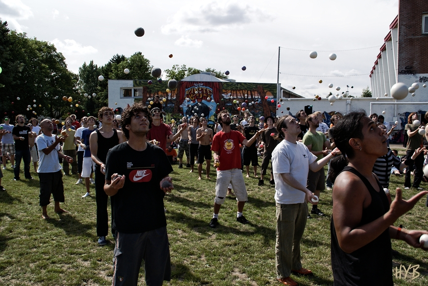
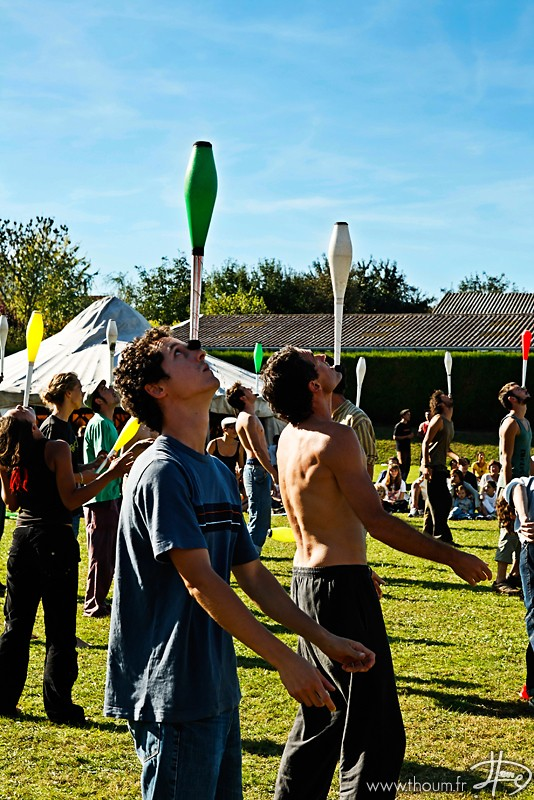
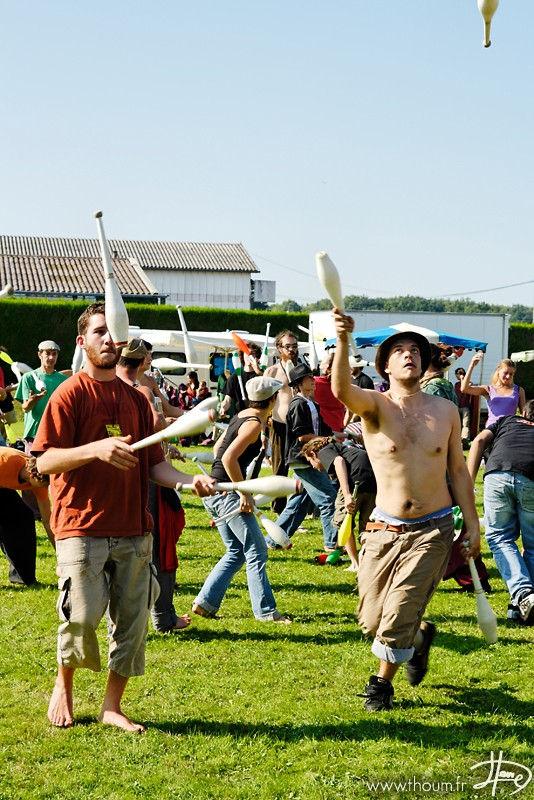
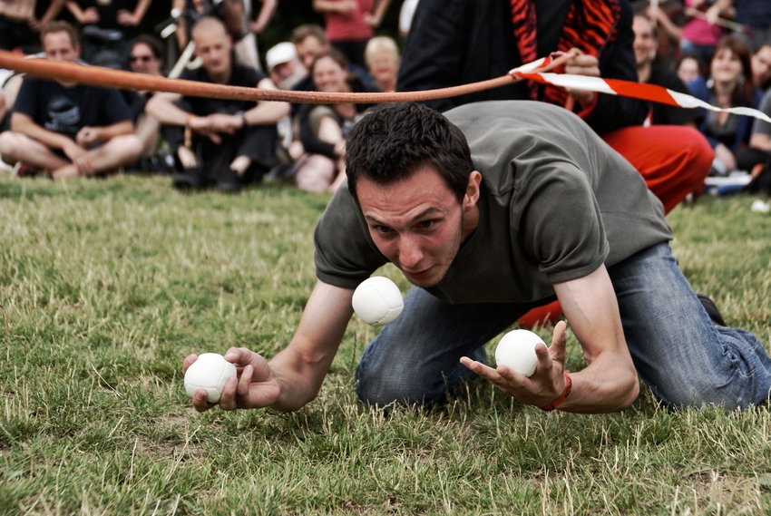
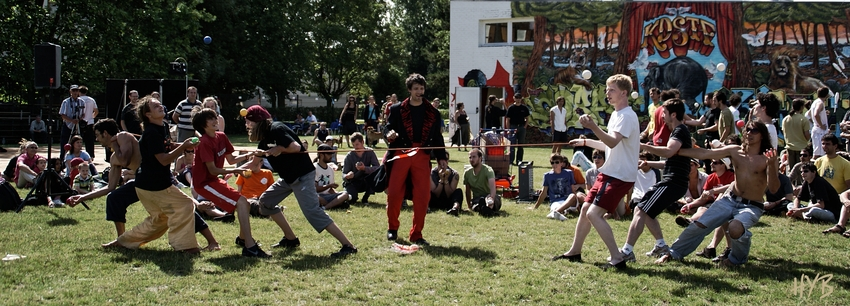
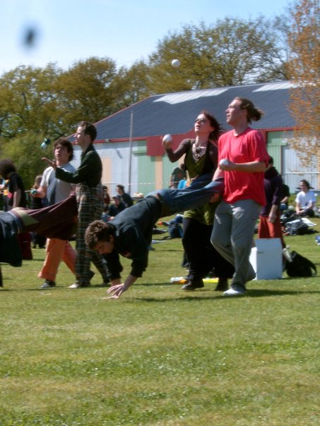
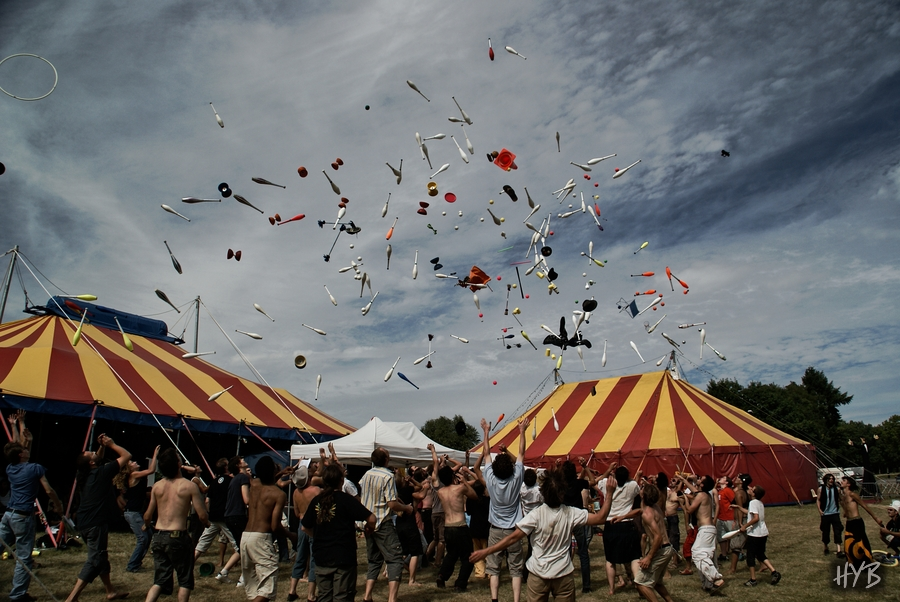

### Les jeux de la jongle

Plantons le décor. Un maître de cérémonie, si possible muni d’un micro, organise et anime les Jeux. Le public, disposé en grand cercle, est composé des participants de la convention mais aussi souvent de riverains venus assister au spectacle. Lorsqu’une épreuve est annoncée par le maître de cérémonie, ceux qui veulent y participer se munissent du matériel nécessaire et rejoignent le centre du cercle. L’épreuve peut alors commencer.

Parlons maintenant de ces fameuses épreuves. Elles ont toutes, deux points communs. Le premier étant que leurs règles sont simples et tiennent souvent en une phrase, pour que les riverains, peu familiers avec le monde de la jonglerie, ou les enfants, soient à même de les comprendre. Le second point commun est que le rendu de l’épreuve soit spectaculaire et visible de loin, pour faire le spectacle ! Autre point important, les épreuves sont choisies pour essayer de faire participer tout le monde au moins une fois : il en faut pour tous les goûts et tous les niveaux. A la clef de ces jeux, il y a souvent des lots, parfois offerts par les magasins de matériel présent sur le site de la convention. Mais on participe aux jeux le plus souvent par plaisir ou par défi personnel plus que par ambition du gain du prix.

Beaucoup de jeux sont communs à toutes les conventions, mais rien ne vous empêche de créer votre propre épreuve en fonction de vos envies, de vos idées, de votre matériel. Une bonne idée aussi est de mettre en avant une spécificité de la région.

**Détaillons quelques jeux connus :**

**Les endurances**

Cette épreuve peut se décliner avec tous les objets de la jonglerie. Le principe est archi-simple : les participant se munissent du matériel nécessaire et commencent à jongler en même temps. Lorsqu’un participant fait tomber un objet, il a perdu et arrête de jongler. Le dernier participant qui continue à jongler est le vainqueur de l’épreuve. Les endurances les plus classiques sont l’endurance à 5 balles et celle ou les participants doivent tenir une massue en équilibre sur leur tête. Mais ensuite, tout est possible : 7 balles, 5 massues, 3 diabolos, à 3 balles les yeux fermés, 3 balles à 1 main, 5 balles sur les épaules de quelqu’un, 5 balles à 2 jongleurs avec chacun 1 main, ... C’est au choix des organisateurs et à adapter en fonction du niveau général des participants.

Attention ceci est une épreuve d’endurance, les participants n’ont pas le droit de se gêner les uns les autres ou de s’affronter physiquement (on garde ça pour l’épreuve du gladiator, voir plus loin). A noter que cette épreuve peut durer très, très, longtemps. Deux choix s’offrent alors au maître de cérémonie. Le premier est de demander aux derniers participants d’exécuter des figures, ou de leur donner des contraintes pour les forcer à prendre des risques et donc augmenter les chances de faire tomber un objet. Le second choix est de demander aux derniers participants de se mettre dans un endroit précis, de les laisser s’affronter et pendant ce temps-là d’enchainer sur les épreuves suivantes.

**Le Gladiateur (aussi appelé lutte ou combat)**

Les participants se saisissent de trois massues et forment un cercle, en général le plus grand possible. Puis ils commencent tous à jongler à trois massues. Le but est simple : être le dernier à jongler ! Tout est permis ou presque pour faire tomber les massues des autres, mais il faut bien sûr rester fair play. Les figures sont autorisées, mais il faut au moins une massue en l’air à chaque instant. Voler les massues des autres est aussi possible. Lorsqu’un participant fait tomber une massue, il quitte le jeu et reste sur le bord du terrain. Petit à petit les massues tombent, et un cercle de participants perdants se forme tout autour. Les éliminés peuvent alors commencer à rétrécir le cercle pour forcer les derniers participants à se rapprocher et à s’affronter. Le dernier qui reste à jongler a gagné. On peut alors faire plusieurs manches pour sélectionner un certain nombre de participants et à la fin organiser la grande finale des meilleurs joueurs.

Il existe des variantes du gladiateur : 
Le gladiateur par équipe de 5 contre 5 avec tout le monde en même temps ou par poule, gladiateur avec bâton du diable à une baguette, monocycle (si un participant met un pied à terre il est éliminé), divers gladiateurs avec des objets en équilibre (couronne de trois massues, balle en équilibre sur la tête).
 
**Les courses jonglées**

Courir aussi vite que possible, tout en jonglant à 3, ou 5 balles, ou massues, ou anneaux, … 
Le premier qui franchit la ligne d’arriver est déclaré vainqueur. 
Variante : Avec un bâton du diable et une seule baguette.
Variante : Course d’obstacles jonglés. Il s’agit de jongler tout en faisant une course obstacles. Des chaises et du scotch peuvent faire de beaux parcours, essayez d’être créatifs.

**Course avec objet en équilibre :**

Chacun à une massue. Il s’agit de marcher ou courir avec une massue en équilibre (front, nez ou menton) jusqu’au point d’arriver. Faire entre 1 et 3 tours sur soi même en maintenant la massue sur son front. Repartir avec la massue en équilibre jusqu’à la ligne d'arrivée. Le plus rapide gagne la partie.
Variante : Faire tenir 3 massues en équilibre sur la tête.
Variante : Faire tenir 1 diabolo en équilibre sur la tête et jongler à 3 balles.
Variante : Relais avec objet en équilibre.

**Course de massacre de verre d'eau avec Hula-hoop :**

Chacun à son tour devra faire tomber un verre d'eau en faisant tourner le hula-hoop autour de sa taille.
Celui qui y arrive le plus vite est déclaré vainqueur.

**Le "saut" en longueur**

Jeu individuel. On jongle à balles, on lance une balle très haut et très loin, on court la rattraper et on continue à jongler. Le joueur ayant parcouru la plus grande distance a gagné !
Variante : Le jeu de la poubelle :
Il faut un container fixe, une ligne de départ où on jongle à 3 balles. On lance une balle, on court pour ouvrir le container, la balle tombe dans le container, gagné. Après on peu réduire la taille du container, augmenter la distance entre la ligne de départ et le container, proposer des tricks freestyle, flasher plus d'une balle ou commencer avec plus de balles.

**Le passing le plus long**

Un jongleur se tient sur une ligne pendant que l’autre recule progressivement et en passant 6 balles ou massues, ou anneaux, ou autres. Le duo qui arrive le plus loin l’un de l’autre sans dropper a gagné.
Variante avec diabolos : Formez une équipe de 2 diabolistes. Chaque diaboliste à 1 diabolo (donc 2 par équipe). Plusieurs équipes s'affrontent. Chaque binôme, de chaque équipe, démarre à la même distance l’un de l’autre. Progressivement, le binôme doit s’éloigner l’un de l’autre, tout en continuant de se faire des passes. Le but est de réaliser la plus longue passe en diabolo.

**Passing diabolo le plus rapide (en nombre de passes)**

Pendant une minute, il faut se faire le plus de passe à un (ou deux, ou trois) diabolo(s).

**Lancer d’un diabolo et corde à sauter**

Lancer le diabolo, puis faites autant de saut de corde à sauter que possible, avec la ficelle et les baguettes.

**Diabolo dans une boîte**

Tous les participants forment un cercle et lancent leur diabolo dans une boîte placée au milieu. Le vainqueur est celui (ou celle) qui fait rentrer son diabolo dans la boîte.

**La corde** 

Jongler 3 balles (ou massues) et essayer de passer sous une corde tendue de hauteur décroissante à chaque passage. Si tu droppes, tu es dehors. Si tu fais tomber la corde, tu as paumé. Les règles peuvent varier et certains n’autorisent que le contact des pieds avec le sol.
 
**Le Tir à la corde**

Jeu par équipe d’entre 4 et 6 jongleurs. C’est un tir à la corde classique, où chaque équipe en affronte une autre, mais chaque participant tient la corde d’une main et jongle à deux balles de l’autre main. Dès qu’il droppe une balle, il doit lâcher la corde. L'équipe qui arrivera à faire franchir la ligne matérialisée au sol à l'autre équipe sera déclarée vainqueur. Organiser tout cela en quart de finale, demi-finale et finale !
 

**Jacques a dit 3 balles**

On joue à "Jacques a dit" en y incorporant de la jongle à 3 balles. Si tu droppes, tu as perdu. Si tu ne fais pas ce que Jacques a dit, tu as aussi perdu.

**Les siamois**

Course par équipe de deux participants, attachés l’un à l’autre par la cheville. Ils doivent jongler à trois balles au total, donc en passing. Quand une balle tombe, on la ramasse et on continue. Mais on perd du temps !

**La brouette**

Course par équipe de trois participants. L’un pose les mains à terre, et joue le rôle de brouette. Les deux autres restent debout, lui saisissent chacun une jambe avec une main et doivent jongler avec leur autre main en passing avec leur partenaire, le tout à trois balles. Quand une balle tombe, on la ramasse et on continue. Mais on perd du temps !
 
**L’endurance d’équilibre sur les mains**

Une épreuve qui n’a rien à voir avec la jonglerie mais un grand classique : chaque participant doit rester le plus longtemps en positions d’équi-main c’est à dire les deux mains au sol et les pieds ne touchant pas le sol, il n’est pas autorisé de poser la tête mais on peut bouger les mains. Si un joueur pose un pied au sol il est disqualifié. Le gagnant est celui qui est le dernier en position d’équilibre sur les mains

**Concours du meilleur _trick_**

Chaque participant choisit son matériel de jongle (balles, massues, diabolos, bâton, hula hoop, mono, ...)
Deux par deux les joueurs s'affrontent en proposant un trick (3 chances de le réussir). 
Le public choisit (à l'applaudimètre) lequel des deux est qualifié pour le tour suivant.
Le dernier en jeu gagne le concours. En musique c'est mieux !

**Kâma-Sûtra Argentin (Pour tous : débutant et initié)**

Matériel : 1 balle de jonglage pour 2 joueurs.
Règle : Au début chacun dispose de 2 appuis (ses 2 pieds). Un des deux participants à la balle.
Celui qui à la balle va venir la poser au sol et va mettre sa main à côté de la balle ; et va mettre un 4ème appui au sol comme il le veut (genou, main, coude, fesse, tête).
L’autre participant doit prendre la balle et doit la mettre ailleurs ; mais il peut le faire soit en déplaçant l’un de ses appui soit en posant d’autre appui au sol. Pour se faire il a droit à 2 mouvements.
Quand l’un des 2 n’arrive plus à récupérer la balle, il a perdu.
Système de tournoi (qualification, finale)

**Le foot à 5 contre 5 en jonglant à 3 balles**

C’est les mêmes règles et condition que le foot, mais en plus il faut jongler à 3 balles pour se déplacer sur le terrain. Rem : les gardiens doivent aussi jongler !

**Le Toss up**

C’est le grand final en général des jeux de la jongle. Le Toss up n’est pas une épreuve ; tous les participants lancent un ou plusieurs objet (tout type d’objet est accepté pourvu qu’il puisse être lancé) en l’air le plus haut possible en même temps, l’effet visuel est magnifique bien que rapide. Il est possible d’en faire plusieurs et pour éviter de se reprendre les objets sur la tronche, il est préférable de placer les participants en cercle et d’envoyer les objets au centre.

 
**Merci** à JugglingDB, [Jongle.net](http://jongle.net/) et [www.juggling.ch](http://www.juggling.ch/) pour l’inspiration.

Pour d’autres jeux, vous pouvez consulter cette page en anglais assez complète : 
[Juggling Games Encyclopaedia](http://www.twjc.co.uk/games.html)
